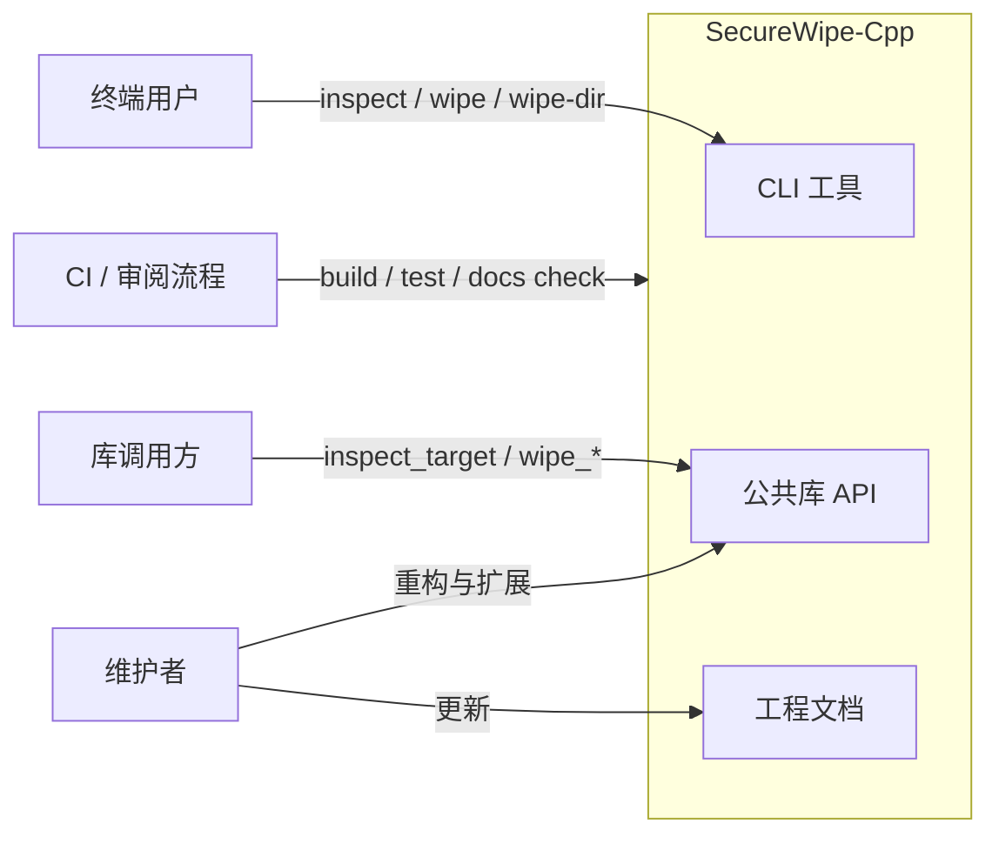
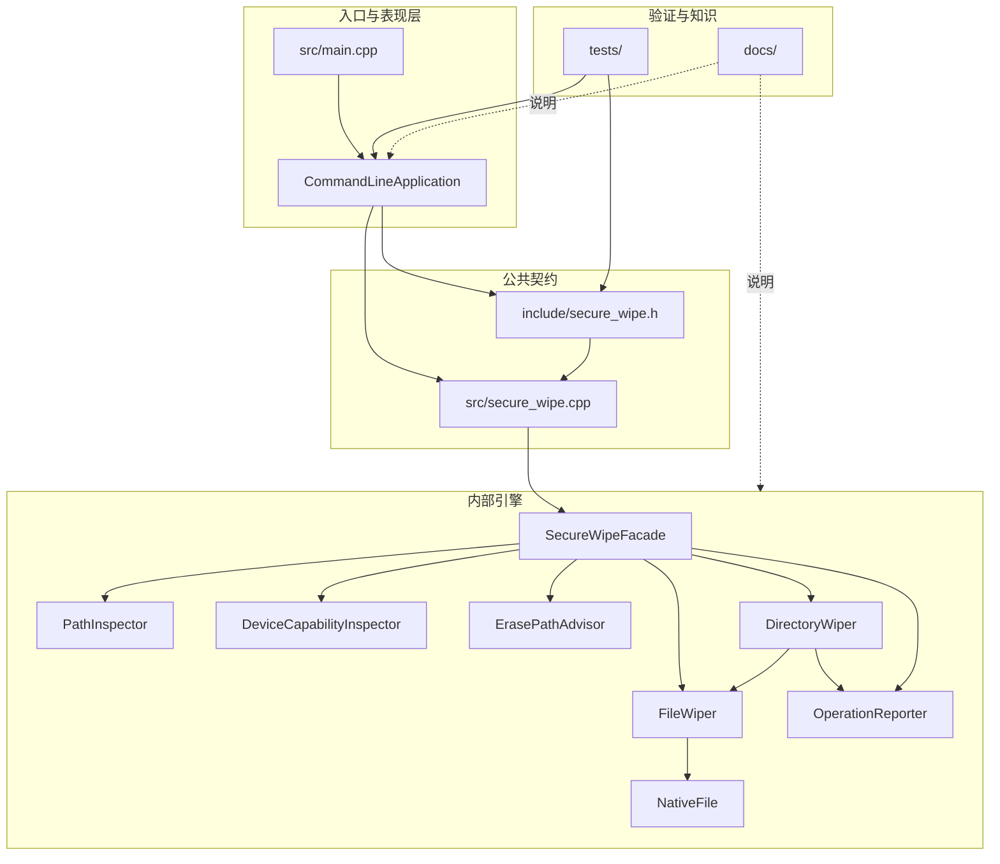
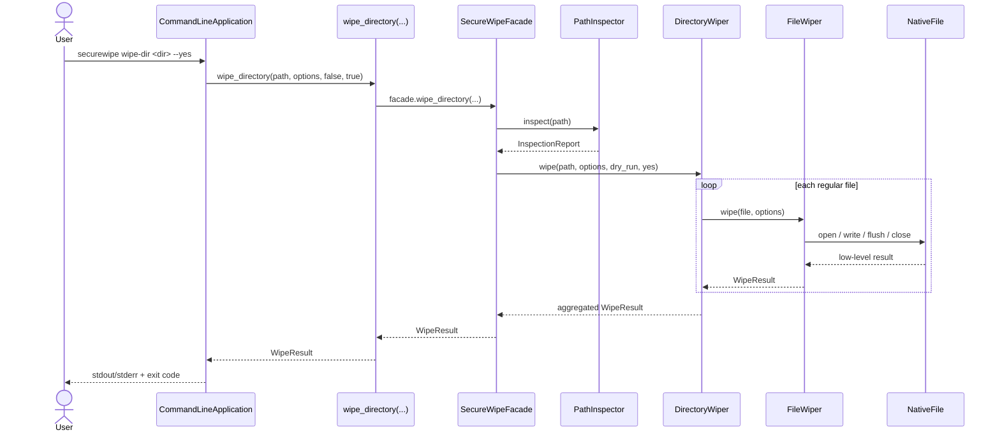

# 系统架构

## 架构驱动因素

当前架构的重点不是把所有擦除相关能力都塞进一个版本，而是围绕以下驱动因素组织代码：

- 安全优先：危险目标要优先拒绝，而不是优先“帮用户做完”。
- 边界清晰：公共契约、CLI 表现层、内部引擎和文档各自负责不同层面的变化。
- 易于演进：未来引入设备级 sanitization、报告系统或更多平台能力时，不必推翻现有接口。
- 易于验证：构建、测试和文档能作为同一套工程交付基线被审查。

## 系统上下文

## 分层概览

| 层次 | 位置 | 职责 |
|---|---|---|
| 公共接口层 | [include/secure_wipe.h][secure-wipe-header] | 提供稳定的对外 API、值类型和顶层函数 |
| 外观层 | [src/secure_wipe.cpp][secure-wipe-src] | 将顶层函数转发到内部对象协作 |
| 内部引擎层 | [src/path_inspector.cpp][path-inspector-src]、[src/device_capability_inspector.cpp][device-capability-inspector-src]、[src/erase_path_advisor.cpp][erase-path-advisor-src]、[src/native_file.cpp][native-file-src]、[src/file_wiper.cpp][file-wiper-src]、[src/directory_wiper.cpp][directory-wiper-src]、[src/secure_wipe_engine.cpp][secure-wipe-engine-src] + [src/internal/secure_wipe_engine.h][secure-wipe-engine-header] | 路径检查、设备能力探测、擦除路径建议、文件句柄管理、文件擦除、目录擦除、报告抽象与对象组合 |
| CLI 应用层 | [src/cli_application.cpp][cli-application-src] + [src/internal/cli_application.h][cli-application-header] | 参数解析、帮助输出、CLI 返回码和表现逻辑 |
| 测试层 | [tests/][tests-dir] | 回归行为与参数校验验证 |
| 文档层 | [docs/][docs-dir]、[mkdocs.yml][mkdocs-yml] | 维护项目知识、使用方式和工程约束 |

## 组件视图

## 关键对象职责

### [PathInspector][path-inspector-src]

- 解析路径
- 判断目标类型
- 检查危险目录
- 估算介质类型和 recommendation

### [DeviceCapabilityInspector][device-capability-inspector-src]

- 基于只读平台探测补充设备能力线索
- 输出 [DeviceCapabilities][secure-wipe-header]
- 保持和 [PathInspector][path-inspector-src] 分离，避免路径检查对象膨胀成新的 God object

### [ErasePathAdvisor][erase-path-advisor-src]

- 基于 [InspectionReport][secure-wipe-header] + [DeviceCapabilities][secure-wipe-header] 生成更细粒度的 [ErasePathAdvice][secure-wipe-header]
- 解释为什么当前更适合保持文件级 best-effort，还是先进入设备级 review
- 只做解释和推荐，不执行 destructive device command

### [NativeFile][native-file-src]

- 封装底层文件句柄
- 用 RAII 方式管理打开/关闭
- 提供 seek、write、flush、close 操作

### [FileWiper][file-wiper-src]

- 验证文件级参数
- 执行覆盖、刷新、截断、重命名、删除
- 生成 [WipeResult][secure-wipe-header]

### [DirectoryWiper][directory-wiper-src]

- 枚举目录中的普通文件
- 实现 dry-run 与确认执行流程
- 调用 [FileWiper][file-wiper-src]
- 通过内部 reporter 抽象报告 dry-run 与单文件失败
- 尝试清理空目录

### [OperationReporter][secure-wipe-engine-header]

- 抽象领域层的操作输出
- 让擦除引擎不直接依赖 `std::cout` / `std::cerr`
- 当前提供 [NullOperationReporter][secure-wipe-engine-header] 与 [StreamOperationReporter][secure-wipe-engine-header] 两种实现

### [SecureWipeFacade][secure-wipe-engine-header]

- 组合 [PathInspector][path-inspector-src]、[DeviceCapabilityInspector][device-capability-inspector-src]、[ErasePathAdvisor][erase-path-advisor-src]、[FileWiper][file-wiper-src]、[DirectoryWiper][directory-wiper-src]
- 为公共 API 提供稳定入口
- 负责编排增强后的 inspect 主流程，而不是让 CLI 或 [PathInspector][path-inspector-src] 自己承载平台分支

### [CommandLineApplication][cli-application-src]

- 解析命令行参数
- 校验参数组合是否合法
- 控制输出和退出码
- 作为 CLI 的唯一应用层对象

## 运行时视图

以下序列图展示 `wipe-dir <dir> --yes` 的主干执行路径：

`inspect --detail <path>` 的主干执行路径则是：先由 [PathInspector][path-inspector-src] 生成基础 [InspectionReport][secure-wipe-header]，再由 [DeviceCapabilityInspector][device-capability-inspector-src] 读取非破坏性能力快照，最后由 [ErasePathAdvisor][erase-path-advisor-src] 追加更细粒度的推荐路径与解释文本。

## 头文件边界

公共头和私有头必须明确分层：

- [include/][include-dir] 只放会被安装或被外部依赖的头文件
- [src/internal/][src-internal-dir] 只放实现层私有头文件

这样做的原因是：

- 避免实现细节被误当成稳定接口
- 降低未来重构对外部调用方的影响
- 让目录语义对新维护者一眼可见

## 关键设计决策

### 公共 API 与实现分离

- [include/secure_wipe.h][secure-wipe-header] 是对外稳定契约。
- [src/internal/][src-internal-dir] 只承载实现细节。
- 这让调用方不需要感知内部对象拆分或文件重构。

### 领域层不直接依赖控制台输出

- 引擎内部通过 [OperationReporter][secure-wipe-engine-header] 抽象操作报告。
- CLI 或 facade 可以决定是否将事件写到 `stdout` / `stderr`。
- 这让测试替身和未来其它表现层更容易接入。

### CLI11 仅停留在 CLI 层

- CLI11 用于参数解析、帮助生成、类型检查和子命令建模。
- 它不会渗透到公共 API 或擦除引擎对象中。
- 当前仓库将 CLI11 vendored 到 [third_party/][third-party-dir]，避免构建时网络依赖进入主流程。

### 文档视为架构资产

- [docs/][docs-dir] 与代码一起演进，而不是作为发布前补充材料。
- 需求、架构、CLI 和安全边界文档共同构成当前工程交付的一部分。

## 当前扩展方向

未来如果引入设备级 sanitization，推荐继续沿用当前边界：

- 继续复用当前已经引入的设备能力探测对象，而不是把逻辑重新塞回 [FileWiper][file-wiper-src]
- 保持每个领域对象的翻译单元粒度，避免重新出现“大而全”的 `*.cpp`
- 通过 [OperationReporter][secure-wipe-engine-header] 一类的抽象继续隔离领域逻辑与表现层输出
- 对外 API 保持稳定，优先扩展值类型和 recommendation 语义
- CLI 只负责暴露能力，不直接内联平台分支或设备命令

[secure-wipe-header]: https://github.com/shushu-cell/SecureWipe-Cpp/blob/main/include/secure_wipe.h
[secure-wipe-src]: https://github.com/shushu-cell/SecureWipe-Cpp/blob/main/src/secure_wipe.cpp
[path-inspector-src]: https://github.com/shushu-cell/SecureWipe-Cpp/blob/main/src/path_inspector.cpp
[device-capability-inspector-src]: https://github.com/shushu-cell/SecureWipe-Cpp/blob/main/src/device_capability_inspector.cpp
[erase-path-advisor-src]: https://github.com/shushu-cell/SecureWipe-Cpp/blob/main/src/erase_path_advisor.cpp
[native-file-src]: https://github.com/shushu-cell/SecureWipe-Cpp/blob/main/src/native_file.cpp
[file-wiper-src]: https://github.com/shushu-cell/SecureWipe-Cpp/blob/main/src/file_wiper.cpp
[directory-wiper-src]: https://github.com/shushu-cell/SecureWipe-Cpp/blob/main/src/directory_wiper.cpp
[secure-wipe-engine-src]: https://github.com/shushu-cell/SecureWipe-Cpp/blob/main/src/secure_wipe_engine.cpp
[secure-wipe-engine-header]: https://github.com/shushu-cell/SecureWipe-Cpp/blob/main/src/internal/secure_wipe_engine.h
[cli-application-src]: https://github.com/shushu-cell/SecureWipe-Cpp/blob/main/src/cli_application.cpp
[cli-application-header]: https://github.com/shushu-cell/SecureWipe-Cpp/blob/main/src/internal/cli_application.h
[tests-dir]: https://github.com/shushu-cell/SecureWipe-Cpp/tree/main/tests
[docs-dir]: https://github.com/shushu-cell/SecureWipe-Cpp/tree/main/docs
[mkdocs-yml]: https://github.com/shushu-cell/SecureWipe-Cpp/blob/main/mkdocs.yml
[include-dir]: https://github.com/shushu-cell/SecureWipe-Cpp/tree/main/include
[src-internal-dir]: https://github.com/shushu-cell/SecureWipe-Cpp/tree/main/src/internal
[third-party-dir]: https://github.com/shushu-cell/SecureWipe-Cpp/tree/main/third_party