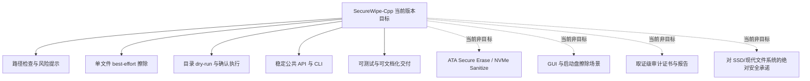

# 需求分析

## 文档目的

本页用于明确当前版本 SecureWipe-Cpp 的问题定义、范围边界、主要需求与验收口径，避免项目在“安全擦除”这一高风险话题上出现目标漂移、能力夸大或文档与代码不一致的问题。

## 问题背景

安全擦除类工具很容易在产品描述上走向两个极端：

- 一种是只强调“多次覆盖”，却忽略 SSD、日志型文件系统、快照和元数据残留带来的现实限制。
- 另一种是试图一步到位覆盖设备级 sanitization、审计证书、GUI 和跨平台底层驱动，导致实现复杂度在早期阶段失控。

SecureWipe-Cpp 当前选择的工程策略是：先交付一个具备路径检查、风险提示、best-effort 文件/目录擦除和可验证工程基线的 CLI/库，再在明确边界的前提下逐步扩展能力。

当前版本已经在 `inspect` 路径上补入了一层**非破坏性的设备能力探测与擦除路径解释**，用于提升 recommendation 的可解释性，但仍然没有进入真实设备级 destructive command 执行。

## 产品目标

- 为终端用户提供可解释的风险检查和受控的破坏性操作入口。
- 为上层调用方提供稳定、清晰的公共 API，而不是暴露内部实现细节。
- 为维护者提供可构建、可测试、可文档化、可重构的工程基线。

## 范围边界图

## 干系人与关注点

| 干系人 | 主要诉求 | 当前文档关注点 |
|---|---|---|
| CLI 终端用户 | 明白什么时候可以擦、什么时候不该擦 | CLI 行为、风险边界、退出码、危险目标拒绝 |
| 库调用方 | 使用稳定接口完成检查与擦除操作 | 公共 API、值类型、返回结果语义 |
| 维护者 | 能安全重构而不破坏边界 | 架构、目录结构、测试、文档同步原则 |
| 代码审阅者 / CI | 能验证交付是否与宣称一致 | 构建、测试、文档严格校验 |

## 主要使用场景

1. 用户在执行破坏性操作前，先通过 `inspect <path>` 或 `inspect --detail <path>` 判断目标类型、危险标记、设备能力线索和推荐策略。
2. 用户对单个敏感文件执行 best-effort 覆盖、截断和删除操作。
3. 用户对目录执行 dry-run，确认将被处理的范围后再显式执行真实擦除。
4. 上层程序通过公共库 API 复用路径检查或擦除能力，而不是直接依赖 CLI 进程输出。

## 功能需求

| 编号 | 需求 | 说明 |
|---|---|---|
| FR-01 | 系统必须支持路径检查 | 能识别路径是否存在，以及其目标类型和风险级别 |
| FR-02 | 系统必须给出推荐策略 | 对 regular file、directory、dangerous directory、symlink 等返回 recommendation |
| FR-03 | 系统必须支持单文件擦除 | 提供 `wipe <path>`，支持 passes 和 pattern 参数 |
| FR-04 | 系统必须支持目录递归擦除 | 提供 `wipe-dir <dir>`，支持 dry-run 与确认执行 |
| FR-05 | 系统必须拒绝高风险目标 | 包括符号链接、危险目录、网络路径等当前不支持或高风险场景 |
| FR-06 | 系统必须输出可判定结果 | CLI 通过稳定退出码表达帮助、执行失败和拒绝；库 API 返回结构化结果 |
| FR-07 | 系统必须保留公共 API 边界 | 外部调用方只依赖 [include/secure_wipe.h][secure-wipe-header]，不依赖实现层私有头 |
| FR-08 | 系统必须提供帮助与使用说明 | CLI 可生成帮助信息，工程文档可解释命令、边界与架构 |
| FR-09 | 系统必须提供非破坏性的设备能力解释 | `inspect --detail` 应能输出设备总线、trim/discard 线索、设备级路径 review 状态和解释文本 |

## 非功能需求

| 编号 | 需求 | 当前落实方式 |
|---|---|---|
| NFR-01 | 安全优先 | 默认拒绝危险目录和符号链接，不把文件级覆盖表述为绝对安全 |
| NFR-02 | 可维护性 | 公共 API、CLI 层和内部引擎分层，私有头限制在 [src/internal/][src-internal-dir] |
| NFR-03 | 可移植性 | 使用 C++20、CMake、CLI11，支持 Windows / Linux / macOS 开发流程 |
| NFR-04 | 可测试性 | 使用 CTest 覆盖 inspect、wipe、wipe-dir 和 CLI 参数回归 |
| NFR-07 | 保守语义 | 对“未知”“受限”“已支持”必须显式区分，避免把启发式推断写成设备级能力确认 |
| NFR-05 | 可文档化 | 使用 MkDocs Material 维护 docs-as-code，并通过 [mkdocs.yml][mkdocs-yml] 对应的 `mkdocs build --strict` 校验 |
| NFR-06 | 可重复构建 | 将 CLI11 vendored 到仓库，避免构建过程依赖运行时下载第三方库 |

## 约束与假设

- 当前版本聚焦文件级和目录级 best-effort 擦除，以及非破坏性的设备能力探测；不实现设备级 sanitize 执行。
- 当前版本的风险提示是显式产品行为，而不是附带说明；用户必须看到“best-effort only”的边界。
- 当前 CLI 是主要交付入口，但库接口同样视为正式工程资产。
- 当前文档默认与当前代码状态绑定，不能把未来规划写成已交付能力。

## 验收口径

| 类别 | 验收标准 |
|---|---|
| 构建 | `cmake -S . -B build` 与 `cmake --build build` 可成功执行 |
| 测试 | `ctest --test-dir build -C Debug --output-on-failure` 通过 |
| 文档 | `mkdocs build --strict` 通过 |
| CLI 一致性 | `inspect`、`wipe`、`wipe-dir` 的说明与实际实现一致 |
| 边界一致性 | 文档中的当前非目标不与代码当前能力冲突 |

## 需求与实现追踪

| 需求 | 主要实现落点 | 主要验证方式 |
|---|---|---|
| FR-01 / FR-02 | [PathInspector][path-inspector-src]、[inspect_target(...)][secure-wipe-header]、CLI `inspect` | [tests/test_secure_wipe.cpp][test-secure-wipe] 中 inspect 相关测试 |
| FR-03 | [FileWiper][file-wiper-src]、[wipe_file(...)][secure-wipe-header]、CLI `wipe` | 文件擦除测试与 CLI 参数测试 |
| FR-04 | [DirectoryWiper][directory-wiper-src]、[wipe_directory(...)][secure-wipe-header]、CLI `wipe-dir` | dry-run、确认执行和参数回归测试 |
| FR-05 | [PathInspector][path-inspector-src]、CLI 返回码控制 | 危险目录与拒绝路径测试 |
| FR-09 | [DeviceCapabilityInspector][device-capability-inspector-src]、[ErasePathAdvisor][erase-path-advisor-src]、CLI `inspect --detail` | fake probe 测试、advisor 映射测试、详细输出测试 |
| FR-07 | [include/secure_wipe.h][secure-wipe-header] 与 [src/internal/][src-internal-dir] 边界 | 代码审查、架构文档与构建检查 |
| NFR-05 | [docs/][docs-dir]、[mkdocs.yml][mkdocs-yml] | `mkdocs build --strict` |

## 后续扩展入口

如果未来进入设备级 sanitization、审计报告或更复杂平台探测阶段，应以本页为基线新增需求，而不是直接改写当前范围定义。推荐的做法是：

1. 先补充新的功能/非功能需求与风险说明。
2. 再更新系统架构视图与扩展点。
3. 最后再落代码与测试。

[secure-wipe-header]: https://github.com/shushu-cell/SecureWipe-Cpp/blob/main/include/secure_wipe.h
[src-internal-dir]: https://github.com/shushu-cell/SecureWipe-Cpp/tree/main/src/internal
[mkdocs-yml]: https://github.com/shushu-cell/SecureWipe-Cpp/blob/main/mkdocs.yml
[path-inspector-src]: https://github.com/shushu-cell/SecureWipe-Cpp/blob/main/src/path_inspector.cpp
[file-wiper-src]: https://github.com/shushu-cell/SecureWipe-Cpp/blob/main/src/file_wiper.cpp
[directory-wiper-src]: https://github.com/shushu-cell/SecureWipe-Cpp/blob/main/src/directory_wiper.cpp
[device-capability-inspector-src]: https://github.com/shushu-cell/SecureWipe-Cpp/blob/main/src/device_capability_inspector.cpp
[erase-path-advisor-src]: https://github.com/shushu-cell/SecureWipe-Cpp/blob/main/src/erase_path_advisor.cpp
[test-secure-wipe]: https://github.com/shushu-cell/SecureWipe-Cpp/blob/main/tests/test_secure_wipe.cpp
[docs-dir]: https://github.com/shushu-cell/SecureWipe-Cpp/tree/main/docs