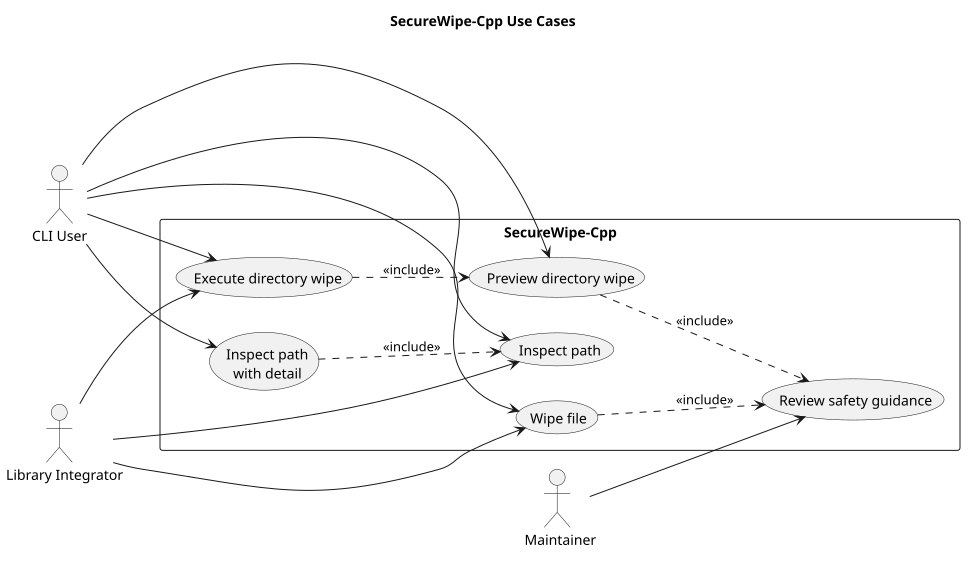
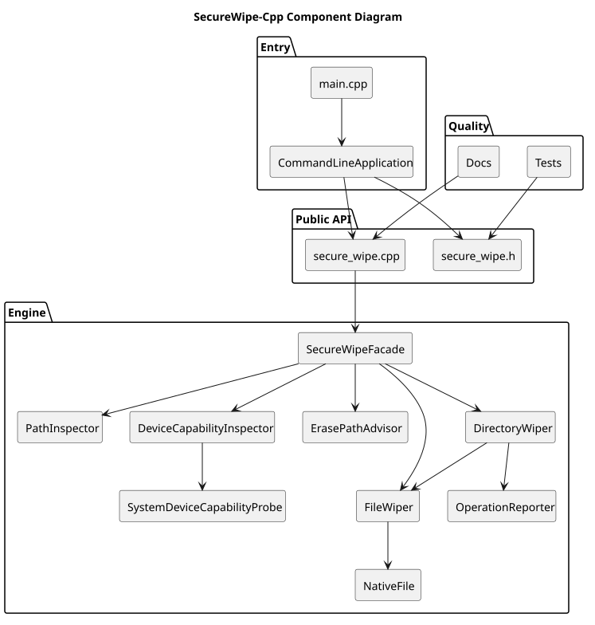
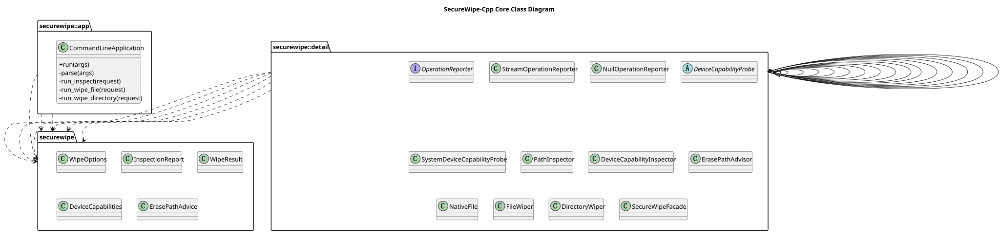
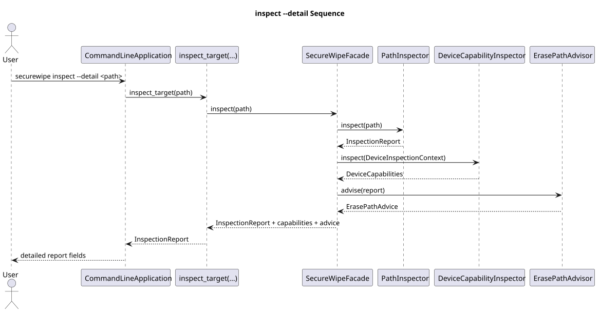
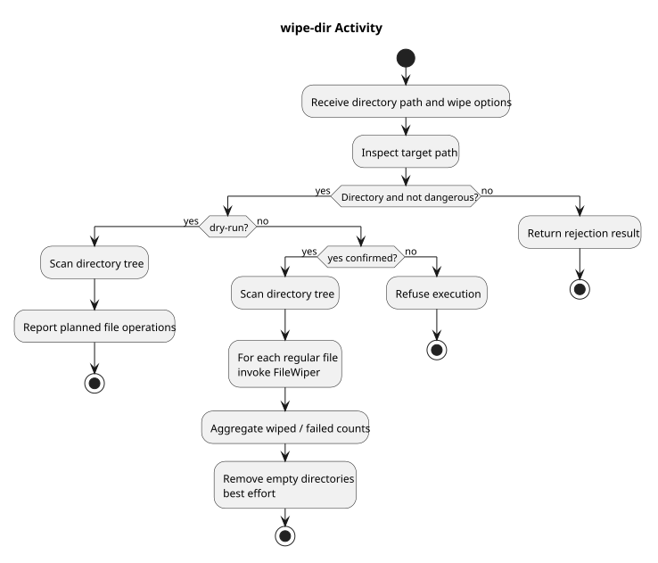

# UML 视图

本页集中维护 SecureWipe-Cpp 当前系统的 UML 视图。目标不是画“好看”的图，而是用标准 UML 视角把当前已落地的结构、参与者和关键执行路径稳定记录下来。

当前页面同时保存两类资产：

- 可维护的 PlantUML 源文件：位于 [docs/uml/diagrams/](../uml/diagrams/)
- 用于文档展示的 SVG 渲染结果：位于 [docs/uml/rendered/](../uml/rendered/)

更新 UML 时，先修改 `.puml`，再运行 [tools/render_uml.py](../../tools/render_uml.py)，最后确认本页、相关工程文档和算法文档仍然匹配。

## 用例图

这张图面向“谁在使用系统、使用系统做什么”。它覆盖 CLI 用户、库调用方和维护者三个最核心角色。

源文件：[use-cases.puml](../uml/diagrams/use-cases.puml)

## 组件图

这张图面向“系统由哪些主要组件构成、它们之间如何连接”。它和 [系统架构](architecture.md) 互补，但这里强调的是组件边界和依赖，而不是文字解释。

源文件：[components.puml](../uml/diagrams/components.puml)

## 类图

这张图聚焦当前已经落地的核心对象及其关系，特别是 CLI 层、外观层和内部引擎对象之间的协作边界。

源文件：[core-classes.puml](../uml/diagrams/core-classes.puml)

## `inspect --detail` 时序图

这张图聚焦非破坏性的检查路径，说明一次详细检查如何从 CLI 进入 API，再进入 facade、路径检查、能力探测和路径建议。

源文件：[inspect-detail-sequence.puml](../uml/diagrams/inspect-detail-sequence.puml)

## `wipe-dir` 活动图

这张图聚焦目录擦除时的决策与活动流程，尤其是安全闸门、dry-run 和真实执行的分叉。

源文件：[wipe-directory-activity.puml](../uml/diagrams/wipe-directory-activity.puml)

## 维护要求

- 当新增或重组 CLI 命令、公共 API、核心对象关系或关键执行流程时，本页和相应 `.puml` 文件必须同步更新。
- PlantUML 源文件是 UML 的事实来源，SVG 只是展示产物。
- 若图和正文冲突，以当前代码为准，修图而不是保留过期说明。