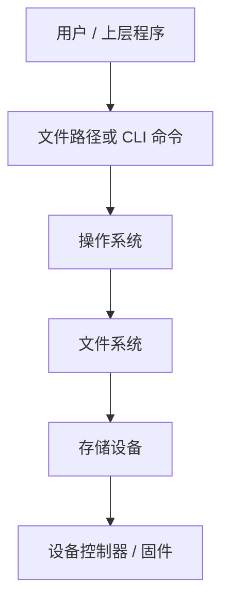

# 背景知识与术语

本页用于给非该领域读者建立最小背景知识，帮助理解 SecureWipe-Cpp 文档里反复出现的操作系统、文件系统、存储设备和安全擦除术语。

如果你在阅读 [安全擦除算法](secure-erasure-algorithms.md) 时看到 `trim/discard`、`FTL`、`wear leveling`、`crypto-erase`、`review-before-wipe` 这类词感到陌生，建议先读完本页再回到算法文档。

## 如何阅读本项目 { #how-to-read }

可以先记住一个非常朴素的分层模型：

1. 人操作的是文件路径和命令行。
2. 操作系统把这些请求交给文件系统。
3. 文件系统再把读写请求交给底层存储设备。
4. 底层设备控制器不一定会完全按照“上层看到的样子”去保存和擦除数据。

这也是 SecureWipe-Cpp 一直强调“先 inspect、再决定是否 destructive”的原因：应用层看到的世界，和设备内部真正发生的事，并不总是一致。

## 操作系统、文件系统和存储设备分别做什么 { #layer-view }

| 术语 | 通俗解释 | 为什么和本项目有关 |
|---|---|---|
| 操作系统 | 管理文件、进程、设备和权限的总控软件，例如 Windows、Linux、macOS | `inspect`、打开文件、删除文件这些动作都先经过操作系统 |
| 文件路径 | 指向某个文件或目录的“地址” | 用户给 `wipe` 或 `inspect` 的输入就是路径 |
| 目录 | 用来组织文件的“文件夹” | `wipe-dir` 的目标就是目录 |
| 符号链接 | 一个“指向别处”的快捷入口，而不是文件本体 | 当前版本会拒绝对符号链接做破坏性操作，避免误删真正目标 |
| 文件系统 | 负责把“文件”和“目录”映射到磁盘空间的规则系统，例如 NTFS、ext4、APFS | 即使应用写入了覆盖数据，文件系统仍可能保留日志、元数据或快照线索 |
| 元数据 | 描述文件的附加信息，例如文件名、时间戳、权限、位置索引 | 删除内容不等于删除所有元数据痕迹 |
| 日志型文件系统 | 会先记录“准备做什么”，再真正落盘的数据组织方式 | 覆盖写不一定只留下最终那一份数据 |
| 快照 / Copy-on-Write | 为了回滚或一致性而保留历史块、只在修改时复制的新旧版本机制 | 上层“改写了文件”不代表旧数据块一定被原地覆盖 |
| 块设备 | 以固定大小块读写的存储接口抽象，例如硬盘、SSD、U 盘 | `DeviceCapabilityInspector` 需要从块设备层面推断能力 |

## 为什么 SSD 上的覆盖写不等于彻底清除 { #ssd-limitations }

### HDD 与 SSD 的差别

- HDD 可以简单理解为“旋转磁盘 + 磁头寻址”，位置相对直观。
- SSD、U 盘、eMMC 这类闪存设备则更像“控制器在中间调度的大型闪存池”。

对 HDD 来说，“对同一位置覆盖写”更接近直觉中的原地重写。

对 SSD 来说，控制器通常会为了寿命、性能和坏块管理，把新的写入放到别处，再更新映射关系。这就是为什么文件级覆盖在 SSD 上很难被表述成“彻底清除”。

### 这里会遇到的关键术语

| 术语 | 通俗解释 | 为什么重要 |
|---|---|---|
| FTL | Flash Translation Layer，闪存映射层。它负责把上层看到的逻辑块地址映射到真实闪存页 | 应用层以为在重写“原位置”，设备内部可能其实写到了新位置 |
| Wear Leveling | 均衡磨损，让不同闪存块轮流承担写入，避免部分区域过快损坏 | 会进一步削弱“多次覆盖 = 更安全”的直觉 |
| Remapping | 控制器把某些旧块或坏块替换到别的物理位置 | 历史数据可能留在上层再也看不到的旧块中 |
| Overprovisioning | 设备为性能和寿命预留的额外空间，用户通常看不到 | 这部分空间里的旧数据不受文件级删除直接控制 |
| Trim / Discard | 操作系统告诉设备“这些逻辑块已经不用了”的提示 | 这是“提示可以回收”，不是“已经彻底清除” |

### 这对项目意味着什么

SecureWipe-Cpp 当前版本只承诺**应用层、文件级、best-effort** 擦除流程，而不承诺设备内部所有历史数据都已不可恢复。

这不是项目保守过度，而是对现实设备行为的诚实表述。

## 存储接口与设备形态 { #device-bus-terms }

| 术语 | 通俗解释 | 在项目中的位置 |
|---|---|---|
| ATA / SATA | 传统 PC 存储接口家族，常见于许多 HDD 和部分 SSD | `DeviceBusKind` 会把它们作为一种总线线索输出 |
| NVMe | 更现代的高速 SSD 接口协议，常见于 M.2 SSD | 若检测到 NVMe，通常更值得进入设备级 review，而不是盲目做文件级覆盖 |
| SCSI | 一个较泛化的存储命令家族，很多抽象层会把设备表现成类似 SCSI 的形态 | 能帮助判断当前设备可能支持哪些设备级路径 |
| USB Bridge | 把内部 SATA / NVMe 设备通过 USB 外壳转接出来的桥接器 | 这类设备经常让“真实总线能力”和“外部看起来的能力”不完全一致 |
| 可移动介质 | 可以随时拔插的设备，例如 U 盘、移动硬盘、部分读卡器 | 项目会把它当作额外风险线索，而不是默认等同于普通固定盘 |

## “删除”“覆盖”“截断”“格式化”不是一回事 { #erase-terms }

| 术语 | 通俗解释 | 当前项目怎么用 |
|---|---|---|
| 删除 | 让文件系统不再把某个名字当作可见文件 | 单独删除通常不足以表达“安全擦除” |
| 覆盖写 | 在文件可见内容范围内重新写入新字节 | 当前 `wipe_file` 的核心动作之一 |
| 刷新 `flush` | 尽量把进程缓存中的写入推向底层 | 能提升“写入真的出去过”的可信度，但不是审计证明 |
| 截断 | 把文件长度改短，当前项目里通常会截断到 0 | 用来减少文件可见内容残留 |
| 改名 | 把原始文件名换成更不具语义的名字 | 用来降低文件名残留的可见性 |
| 格式化 | 重建文件系统结构，可能是快速，也可能是完整 | 这不是当前项目的文件级擦除流程 |
| Sanitization | 更广义的介质清除概念，强调达到明确清除目标 | 当前版本只做 capability review，不做 destructive execution |

## 设备级擦除相关术语 { #sanitization-terms }

| 术语 | 通俗解释 | 为什么当前版本没有直接执行 |
|---|---|---|
| Secure Erase | 某些 ATA 设备提供的设备级清除命令 | 需要更严格的设备识别、权限控制、状态验证和失败处理 |
| NVMe Sanitize | NVMe 设备的设备级清除能力家族 | 属于“整设备级”操作，不适合临时拼进文件级流程 |
| Format NVM | NVMe 设备层面的格式化/重置能力 | 语义和文件系统里的“格式化”不同，风险也更高 |
| Crypto-Erase | 通过销毁加密密钥来让旧数据不可解读 | 前提是设备或介质本身真的在用对应的加密模型 |
| PSID Revert | 某些自加密设备的恢复/重置路径 | 风险高、前提多，不适合作为当前版本的默认动作 |

当前项目里的 `device-sanitize-review`、`crypto-erase-review` 这些词，意思是“值得人工进入这条设备级路径做复核”，不是“当前程序已经执行了该命令”。

## 项目输出里几个最容易误解的词 { #project-terms }

| 项目术语 | 应该怎么理解 | 不应该怎么理解 |
|---|---|---|
| `best-effort` | 在应用层尽力去覆盖、刷新、截断、改名和删除 | 绝对不可恢复保证 |
| `inspect` | 先检查目标，再决定是否进入破坏性流程 | 只是打印一些漂亮信息 |
| `recommendation` | 系统根据风险和介质线索给出的建议路径 | 法律、审计或取证级结论 |
| `review-before-wipe` | 暂停在“应该先人工复核”的阶段 | 鼓励用户直接继续 destructive 动作 |
| `inspect --json` | 把同一份只读 inspection result 导出成机器可读 JSON | 独立的执行计划文件或自动执行队列 |
| `capability-evidence` | 当前结论背后的结构化只读证据，包含主题、来源、置信度和摘要 | 审计报告或硬件厂商确认书 |
| `preflight-risk` | 系统在执行前识别出的结构化风险标记 | 最终不可恢复性的证明 |
| `preflight-action` | 当前可见的候选动作及其状态、作用范围和摘要 | 程序已经自动排队执行的步骤 |
| `current-path` | 面向当前文件或目录路径的动作范围 | 已经控制了整块底层设备 |
| `underlying-device` | 提醒用户关注底层设备级路径 | 当前版本已经能直接执行 sanitize / crypto-erase |
| `Unknown` | 当前没有足够信息，不能做强结论 | “大概率支持，只是没显示出来” |
| `Restricted` | 某些线索存在，但不够可靠，或者有额外限制 | 基本等于 Supported |

## 给非技术读者的一个短结论 { #plain-language-summary }

如果把这个项目看成一个现实世界工具，它当前更像：

- 一个会先帮你判断“该不该动手”的风险检查器；
- 一个能对普通文件和目录执行尽力而为删除流程的工具；
- 一个会明确告诉你“这里已经超出应用层能力边界”的保守系统。

它当前不是：

- 一个对任何存储设备都能给出彻底不可恢复保证的黑盒工具；
- 一个已经实现完整设备级 sanitization 执行和审计验证的产品。

## 维护要求 { #maintenance }

当项目引入新的设备能力术语、文件系统限制、存储接口类型或清除路径时，本页必须同步更新，避免算法文档直接堆叠未解释的新名词。