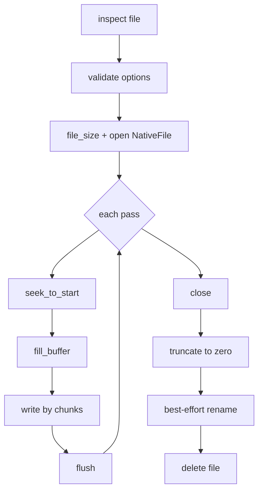

# 安全擦除算法技术文档

本页用于记录 SecureWipe-Cpp 当前版本采用的安全擦除相关算法、选型理由、源码实现位置、参考文献与评估结论。它与[安全边界](../guide/safety.md)和[系统架构](../engineering/architecture.md)互补：安全边界说明“当前版本真正承诺什么”，本页说明“这些承诺是如何通过当前算法与代码结构落地的”。

## 文档目标与适用范围

当前项目实现的是**应用层、文件级、best-effort 的安全擦除工作流**，不是完整的设备级 sanitization 产品。

这意味着本页主要讨论四类算法与策略：

- 破坏性操作前的路径检查与风险分级
- 非破坏性的设备能力探测与擦除路径解释
- 单文件覆盖、刷新、截断、重命名与删除工作流
- 目录递归扫描、dry-run 和批量聚合工作流
- 介质类型推断与 recommendation 生成逻辑

本页不会把当前实现包装成以下能力：

- ATA Secure Erase
- NVMe Sanitize / Format
- PSID revert
- 基于全盘加密的 crypto-erase
- 取证级验证与审计证书

## 预备知识

### 文件级覆盖不等于设备级清除

应用层能直接控制的是“文件路径、文件句柄和文件系统可见范围内的数据”。对现代 SSD、eMMC、U 盘、日志型文件系统、快照型文件系统而言，底层控制器、FTL、写放大、重映射和元数据日志都可能让“应用看到的覆盖写”与“介质上所有历史数据都已清除”不是同一件事。

因此，当前项目的核心术语不是“绝对不可恢复”，而是：

- `best-effort`：在应用层尽力执行覆盖、刷新、截断和删除
- `recommendation`：根据目标类型、危险度和介质线索提示用户应执行、复核或拒绝执行
- `inspect first`：先检查，再决定是否进入破坏性流程

### 当前算法面向的威胁模型

当前版本主要覆盖以下风险：

- 用户误把根目录、主目录或系统目录当作递归擦除目标
- 用户对符号链接或 network share 发起破坏性操作
- 用户在不了解介质风险的情况下把文件级覆盖误认为设备级 sanitization

当前版本**不**试图单独解决以下问题：

- SSD overprovisioning 区域中的历史数据残留
- RAID、快照、CoW、日志回放带来的隐藏副本
- 厂商控制器专有行为
- 断电恢复后的一致性证明

## 当前算法组合

### 路径检查与策略建议算法

`inspect` 流程是整个项目安全模型的入口，而不是附属功能。其核心步骤是：

1. 规范化路径并保留 canonical/absolute 结果。
2. 通过 `symlink_status` 判断目标是否存在，以及是否为符号链接。
3. 分类目标类型：普通文件、目录、符号链接、其他。
4. 估算介质类型：Windows 侧依据驱动器类型，Linux 侧依据 mount point 和 `/sys/class/block/.../queue/rotational`。
5. 对目录执行危险路径检查，拒绝根目录、主目录和系统目录等高风险目标。
6. 结合目标类型、介质类型和危险度生成 `StrategyRecommendation` 与 warning 列表。

这一算法的作用不是“更聪明地删除”，而是**在删除前先把不能删、暂不该删、只能 best-effort 删除的情况显式暴露出来**。

### 设备能力探测与擦除路径解释算法

当前版本已经把 `inspect` 扩展为一个三段式流程：

1. `PathInspector` 先生成基础 `InspectionReport`。
2. `DeviceCapabilityInspector` 再通过只读平台探测补入 `DeviceCapabilities`。
3. `ErasePathAdvisor` 基于基础 recommendation 与能力快照生成 `ErasePathAdvice`。

当前平台策略是：

- Windows：通过 `IOCTL_STORAGE_QUERY_PROPERTY`、`STORAGE_DEVICE_DESCRIPTOR` 和 `DEVICE_TRIM_DESCRIPTOR` 收集 bus type、可移动介质线索和 trim/discard 线索
- Linux：通过 `/proc/self/mounts` 与 `/sys/class/block/...` 推断块设备、可移动状态、discard 能力和总线形态
- macOS / 其他平台：当前保守回退为 `Unknown` / `Restricted` 风格的能力结论

这里的关键不是“多探测几个字段”，而是把**推断**与**确认**明确分开：

- `DeviceBusKind` 只表示总线或设备形态级别线索
- `CapabilityState` 强制区分 `Unknown / Unsupported / Supported / Restricted`
- `EraseMethod` 当前只表达“更适合 review 哪条路径”，不表达 destructive device command 已可执行

因此，`inspect --detail` 中出现 `device-sanitize-review: supported` 的语义是“当前值得进入设备级 sanitize review”，而不是“当前版本已经执行并验证了 sanitize 命令”。

### 单文件安全擦除工作流

当前单文件算法采用“覆盖 + 刷新 + 截断 + 尽力改名 + 删除”的组合策略：

1. 先通过 `inspect` 确认目标是普通文件。
2. 校验 `passes >= 1`、`block_size >= 1`。
3. 获取文件大小并打开底层文件句柄。
4. 对每一轮 pass：
   1. 将文件指针回到起始位置。
   2. 按块填充 buffer。
   3. 循环写入直至覆盖可见文件长度。
   4. 执行 `flush`，尽量把缓存中的写入刷新到底层。
5. 关闭文件句柄。
6. 将文件截断为 0 字节。
7. 尝试把文件名改成更不具语义的占位名。
8. 删除文件。

覆盖模式当前支持两种：

- `Pattern::Zeros`：使用零字节填充 buffer
- `Pattern::Random`：使用伪随机字节填充 buffer

对应主流程如下：

### 目录递归擦除工作流

目录算法以“先检查，再扫描，再 dry-run/执行”的形式组织：

1. 先通过 `inspect` 判断目标是否是目录以及是否属于危险目录。
2. 若既不是 `--dry-run` 也没有 `--yes`，直接安全停止。
3. 递归扫描目录树，只收集普通文件与子目录，跳过符号链接并阻止继续递归。
4. `--dry-run` 时只报告将要处理的文件集合，不做删除。
5. `--yes` 时对扫描出的每个普通文件调用单文件擦除算法，并聚合成功/失败数量。
6. 执行结束后逆序尝试删除空目录。

这套算法把“目录遍历”和“真正的擦除动作”分成两个阶段，原因是：

- 递归操作风险更高，需要先让用户看到规模和范围
- dry-run 可以作为批量破坏性操作前的安全闸门
- 目录层只聚合结果，不重新实现文件覆盖逻辑

## 算法选型理由

### 当前已选方案

| 方案 | 当前状态 | 选型理由 |
|---|---|---|
| `inspect` 先行 | 已采用 | 先判断目标类型、危险度和介质线索，比“直接执行再报错”更符合安全优先原则。 |
| `Zeros` 作为默认覆盖模式 | 已采用 | 行为确定、易于测试、实现简单，不会制造“复杂模式一定更安全”的误导。 |
| `Random` 作为可选模式 | 已采用 | 提供另一种覆盖形态，但仍然明确属于文件级 best-effort。 |
| 可配置 `passes` | 已采用 | 保留 CLI/API 灵活性，同时不把多次覆盖表述为 SSD 上的强保证。 |
| 覆盖后 `flush` | 已采用 | 让应用层至少显式执行刷新步骤，而不是只依赖进程结束时的隐式落盘。 |
| 截断 + 尽力改名 + 删除 | 已采用 | 在应用层进一步减少可见文件内容与文件名残留，但仍保持“best-effort only”的表述。 |
| 目录 `dry-run` / `--yes` 双闸门 | 已采用 | 降低递归擦除误操作风险，让批量操作更可预览。 |

### 当前明确未选方案

| 方案 | 当前状态 | 未采用原因 |
|---|---|---|
| Gutmann / DoD 多模式覆盖 | 未采用 | 现代介质上“覆盖图案越多越安全”的收益并不稳定，反而增加实现与解释负担。 |
| 空闲空间覆盖 | 未采用 | 风险高、系统扰动大、文件系统边界复杂，当前版本先聚焦路径明确的文件/目录目标。 |
| ATA / NVMe 设备级 sanitization 执行 | 未采用 | 当前版本只实现了非破坏性的能力探测与路径解释，还没有进入 destructive command 执行与验证链路。 |
| Crypto-erase / PSID revert | 未采用 | 依赖设备或全盘加密能力，必须与设备模型和证据输出一起设计，不能临时拼接到当前文件级流程上。 |
| 取证级验证报告 | 未采用 | 当前缺乏设备状态日志、抽样验证和证书模型，不能把 CLI 输出冒充成审计证据。 |

## 算法与源码实现关联

### 公共入口与内部落点

| 算法职责 | 公共入口 | 主要实现位置 | 说明 |
|---|---|---|---|
| 路径检查与 recommendation | [inspect_target(...)][secure-wipe-header] | [src/path_inspector.cpp][path-inspector-src] | 生成 [InspectionReport][secure-wipe-header]，是所有破坏性操作前的安全入口。 |
| 设备能力探测 | [inspect_target(...)][secure-wipe-header] | [src/device_capability_inspector.cpp][device-capability-inspector-src] | 通过只读平台探测补入 [DeviceCapabilities][secure-wipe-header]。 |
| 擦除路径解释 | [inspect_target(...)][secure-wipe-header] | [src/erase_path_advisor.cpp][erase-path-advisor-src] | 基于 recommendation 与能力快照生成 [ErasePathAdvice][secure-wipe-header]。 |
| 单文件擦除 | [wipe_file(...)][secure-wipe-header] | [src/file_wiper.cpp][file-wiper-src] + [src/native_file.cpp][native-file-src] | 负责覆盖、刷新、截断、改名和删除。 |
| 目录擦除 | [wipe_directory(...)][secure-wipe-header] | [src/directory_wiper.cpp][directory-wiper-src] | 负责扫描、dry-run、聚合和目录清理。 |
| 公共 API 到内部引擎的转发 | [include/secure_wipe.h][secure-wipe-header] + [src/secure_wipe.cpp][secure-wipe-src] | [src/secure_wipe.cpp][secure-wipe-src] | 通过 facade 组合内部对象，而不是把算法细节暴露到公共头文件。 |

### 关键函数级关联

| 源文件 | 关键函数 / 对象 | 与算法的关系 |
|---|---|---|
| [src/path_inspector.cpp][path-inspector-src] | [PathInspector::inspect][path-inspector-src] | 组合目标类型判断、危险路径判定、warning 生成与 recommendation 推导。 |
| [src/path_inspector.cpp][path-inspector-src] | [PathInspector::detect_storage_kind][path-inspector-src] | 负责给出 HDD/SSD/可移动盘/网络盘等粗粒度介质线索。 |
| [src/path_inspector.cpp][path-inspector-src] | [PathInspector::is_dangerous_directory][path-inspector-src] | 保护根目录、主目录和系统目录等高风险路径。 |
| [src/device_capability_inspector.cpp][device-capability-inspector-src] | [SystemDeviceCapabilityProbe::probe][device-capability-inspector-src] / [DeviceCapabilityInspector::inspect][device-capability-inspector-src] | 负责只读设备探测、bus kind 推断、trim/discard 线索读取和能力状态映射。 |
| [src/erase_path_advisor.cpp][erase-path-advisor-src] | [ErasePathAdvisor::advise][erase-path-advisor-src] | 负责把粗粒度 recommendation 提升为更细粒度的路径建议与理由文本。 |
| [src/file_wiper.cpp][file-wiper-src] | [FileWiper::wipe][file-wiper-src] | 实现单文件主流程：检查、覆盖、刷新、截断、删除。 |
| [src/file_wiper.cpp][file-wiper-src] | [FileWiper::fill_buffer][file-wiper-src] | 具体生成零填充或随机填充块。 |
| [src/file_wiper.cpp][file-wiper-src] | [FileWiper::obscure_name_best_effort][file-wiper-src] | 尝试用占位文件名替换原有文件名。 |
| [src/native_file.cpp][native-file-src] | [NativeFile::write][native-file-src] / [flush][native-file-src] / [close][native-file-src] | 负责底层文件句柄写入、刷新与关闭。 |
| [src/directory_wiper.cpp][directory-wiper-src] | [DirectoryWiper::scan][directory-wiper-src] | 递归枚举普通文件并跳过符号链接。 |
| [src/directory_wiper.cpp][directory-wiper-src] | [DirectoryWiper::wipe][directory-wiper-src] | 负责 dry-run、安全闸门和批量聚合结果。 |
| [src/cli_application.cpp][cli-application-src] | [CommandLineApplication::run_*][cli-application-src] | 将算法能力暴露给 CLI，并把 recommendation/warning 呈现给用户。 |

### 代码结构如何支撑算法维护

当前实现把算法拆到了多个单一职责翻译单元里：

- [PathInspector][path-inspector-src] 只负责“先判断能不能做、应该怎么提示”。
- [FileWiper][file-wiper-src] 只负责“如何对一个普通文件执行 best-effort 擦除”。
- [DirectoryWiper][directory-wiper-src] 只负责“如何安全地把单文件算法扩展到目录树”。
- [NativeFile][native-file-src] 负责跨平台底层句柄操作细节。
- [src/secure_wipe.cpp][secure-wipe-src] 和 [include/secure_wipe.h][secure-wipe-header] 负责稳定公共边界。

这种拆分的直接好处是：未来若引入设备级 sanitization，可以新增独立对象和独立代码路径，而不必把平台命令与设备分支强行塞进 [FileWiper][file-wiper-src]。

## 算法评估

### 安全性评估

当前算法在“普通文件/目录 + 本地文件系统 + 应用层 best-effort 擦除”这个边界内是自洽的，因为它至少做到了：

- 先检查再删除，而不是无条件执行破坏性操作
- 明确拒绝符号链接、危险目录和 network share
- 在介质未知、固定盘、可移动盘或 SSD 线索场景下主动提高 warning 与 recommendation 等级
- 不把多次覆盖或随机覆盖写成“绝对安全”

但它仍然有明确上限：

- 无法控制设备级 remapping、wear leveling 和隐藏块
- 无法证明日志型 / 快照型文件系统没有留下额外副本
- 无法给出取证级审计证据

### 工程性评估

当前选型偏向“可验证、可解释、可维护”的工程基线：

- 算法复杂度适中，利于测试和代码审查
- `Zeros` / `Random` / `passes` 已能覆盖当前 CLI/API 需要的最小策略面
- 通过 [InspectionReport][secure-wipe-header] 和 [WipeResult][secure-wipe-header] 把决策结果显式建模，而不是隐含在控制流里
- CLI、公共 API 和内部引擎边界清晰，便于后续演进

### 未来演进评估

若项目未来目标提升到“设备感知、可验证的 sanitization 工具”，建议下一阶段按以下方向扩展，而不是继续堆叠文件级覆盖花样：

1. 在现有独立设备能力探测层之上继续细化结构化证据输出，而不是把证据重新折叠回自由文本。
2. 为 ATA / NVMe 设备级清除建立单独的命令执行与状态验证路径。
3. 将验证与报告作为一等能力，输出比“命令执行成功”更强的证据。
4. 若继续研究文件级 SSD 安全删除，应优先关注 crash consistency、crypto-delete 和设备黑盒假设下的可证性问题。

## 参考文献

1. NIST SP 800-88 Rev.1, Guidelines for Media Sanitization.
2. NIST SP 800-88 Rev.2, Guidelines for Media Sanitization.
3. IEEE Std 2883-2022, Standard for Sanitizing Storage.
4. GNU Coreutils Manual, `shred`.
5. `wipe(1)` manual page.
6. Michael Wei, Laura M. Grupp, Frederick E. Spada, Steven Swanson. Reliability of Erasing Data From Flash-Based Solid State Drives. FAST 2011.
7. Heechan Kim, Seongjun Ahn, Sang Lyul Min. Secure File Deletion for Solid State Drives. 2016.
8. Holepunch: Fast, Secure File Deletion with Crash Consistency. 2024.
9. 仓库内 [refs/deep-research-report.md][deep-research-report] 深度研究报告，用于汇总标准、研究论文与产品调研背景。

## 维护要求

当以下内容发生变化时，本页必须同步更新：

- [Pattern][secure-wipe-header]、[WipeOptions][secure-wipe-header]、[InspectionReport][secure-wipe-header] 或 [WipeResult][secure-wipe-header] 的公共语义变化
- [src/path_inspector.cpp][path-inspector-src]、[src/file_wiper.cpp][file-wiper-src]、[src/directory_wiper.cpp][directory-wiper-src] 中的主流程变化
- 新增设备级 sanitization、报告系统或新的 recommendation 语义
- 安全边界或 CLI 帮助文本发生实质变化

[secure-wipe-header]: ../../include/secure_wipe.h
[secure-wipe-src]: ../../src/secure_wipe.cpp
[path-inspector-src]: ../../src/path_inspector.cpp
[device-capability-inspector-src]: ../../src/device_capability_inspector.cpp
[erase-path-advisor-src]: ../../src/erase_path_advisor.cpp
[file-wiper-src]: ../../src/file_wiper.cpp
[native-file-src]: ../../src/native_file.cpp
[directory-wiper-src]: ../../src/directory_wiper.cpp
[cli-application-src]: ../../src/cli_application.cpp
[deep-research-report]: ../../refs/deep-research-report.md