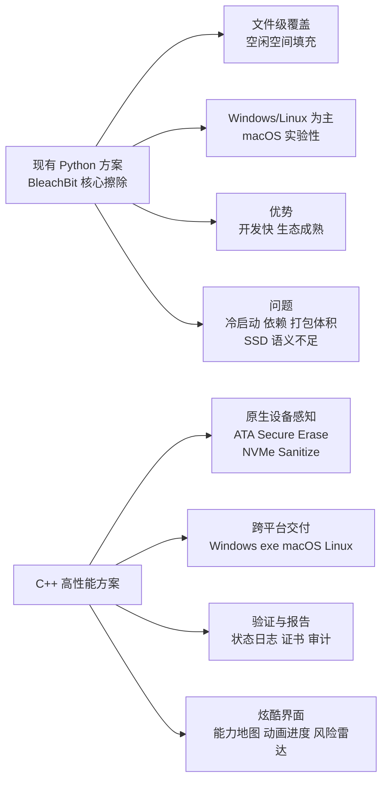
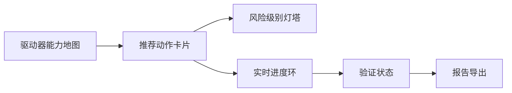
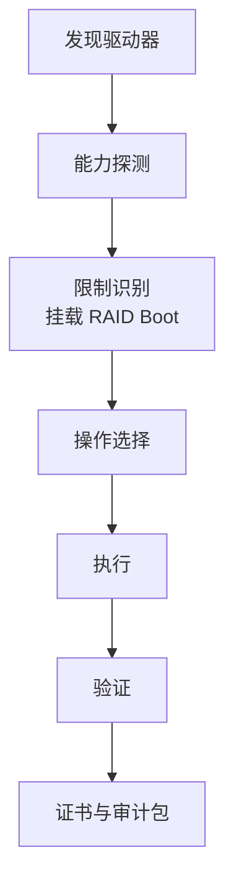
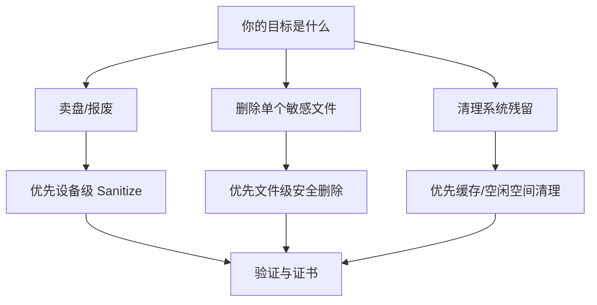
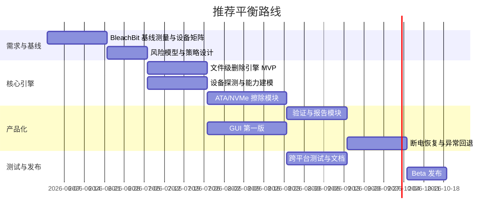

# 用 C++ 重写 BleachBit 核心安全擦除功能项目深度研究报告

## 执行摘要

这个项目**有现实动机，但当前表述还不够“硬核”**。如果你的论点只是“Python 慢、C++ 快”，说服力其实有限：对**整盘覆盖写**这类任务，瓶颈往往首先是文件系统、缓存策略、控制器行为与介质本身，而不是解释器；真正能把项目从“语言重写”升级为“安全产品”的关键，不是把 Python 改成 C++，而是把**设备感知、SSD 正确语义、硬件 sanitize、验证与审计**真正做进去。公开资料表明，BleachBit 目前主要是 Windows/Linux 工具，macOS 仅为“实验性支持且功能有限”；其源码运行方式仍是 `python3 bleachbit.py`，Windows 版本则打包并捆绑依赖。与此同时，公开启动时间基准里，C++“hello world”量级通常在亚毫秒到数毫秒，而 Python 3 在同类测试中常是几十到上百毫秒，这说明**冷启动、打包体积、跨平台交付**确实是合理动机；但如果目标是“更安全”，那就必须正视 SSD、FTL、TRIM、ATA Secure Erase、NVMe Sanitize、crypto-erase 等问题。citeturn35search3turn17search7turn7search0turn33view0turn13view0turn16view0turn14view0

从工程判断看，这个项目**可行，但分层次可行**：如果只做“文件粉碎 + 空闲空间覆盖 + 原生 GUI/CLI”，难度中等，差异化有限；如果做到“文件级 + 块设备级双栈”“自动选择 ATA/NVMe/SCSI/eMMC 最优擦除路径”“验证日志与证书”“断电恢复与风险提示”，难度会明显升高，但项目价值会显著跃升。界面方面，如果只做传统表单式擦除器，炫酷感不足；如果做成“能力雷达 + 擦除路径可视化 + 实时验证进度 + 风险灯塔 + 报告工作台”，会更像一款现代安全产品。citeturn38view2turn14view3turn16view0turn22search0

综合建议是：**不要把项目定义成“用 C++ 重写 BleachBit”**，而要定义成**“跨平台、设备感知、可验证的安全擦除引擎与桌面产品”**。也不要执着于“完全零依赖”的宣传口径——核心引擎尽量少依赖是对的，但想要真正做出高质量跨平台 GUI、稳定权限提升、硬件交互和报告系统，通常应允许“核心少依赖，UI 有限依赖”的务实策略。否则，你会把大量时间消耗在重复造 GUI、日志、参数解析和打包轮子上，而不是把精力投入到真正决定成败的**设备语义与验证链路**。citeturn25search0turn25search7turn24search12turn24search8turn24search2turn24search3

## 动机评估与验证

### 动机是否充分

“Python 依赖多、效率低、难跨平台部署”这个动机**部分成立**，但要分清主次。公开资料显示，BleachBit 源码是以 `python3 bleachbit.py` 启动的，Windows 下载页也明确写着“BleachBit bundles its dependencies”；而官方下载页同时说明 macOS 版本仍是“实验性支持且功能有限”。这说明：**部署形态、依赖控制、平台覆盖**确实是当前实现的真实痛点。citeturn17search7turn7search0turn35search3

但如果你要说“C++ 更安全”，那就不能只谈语言。NIST 对媒体清除的最新指导明确强调，安全擦除取决于**介质类型、支持的 sanitize 命令、设备未覆盖区域、验证测试结果**等技术条件；GNU `shred` 的官方手册也明确提醒，现代日志型/快照/RAID 文件系统以及 SSD 的 wear leveling 都会破坏“原地覆盖”的前提假设。换句话说，**安全性的关键不是把 Python 换成 C++，而是把“针对 SSD 的正确擦除路径”和“可验证性”做对**。citeturn16view0turn40view0

### 可量化的瓶颈与应如何测

就“冷启动”而言，公开 startup-time 基准里，C++ hello-world 在桌面测试上约为 **0.79 ms**，而 Python 3 为 **25.84 ms**；在 Raspberry Pi 3 这类较慢硬件上，C++ 约 **8.24 ms**，Python 3 约 **197.79 ms**。CPython 核心开发文档也给出更一般化的经验区间：CPython 启动通常在 **8 ms 到 100 ms** 之间，而 CPython 讨论中也出现过“hello world 大约 30–40 ms”的量级。这说明：**如果你的产品形态是 CLI、小工具链集成、右键菜单、批处理自动化，C++ 改写对启动体验具有真实价值**。citeturn33view0turn32search18turn32search6

就“I/O 吞吐”而言，情况更复杂。公开的 BleachBit 问题报告显示，在 FAT32 介质上进行 free-space wipe 时，曾出现“写入 8,024,788,992 字节，用时 892 秒，速度约 9.00 MB/s”的实测日志，同时伴随 4GB 文件限制相关错误；另有问题报告显示，空闲空间擦除会把磁盘临时填满，甚至造成分区异常访问问题。这些案例说明：在真实场景中，**I/O 速度和稳定性经常被文件系统、临时文件策略、可用空间边界条件、设备缓存行为主导**，并不只是语言解释器开销。也因此，真正合理的产品动机应是“**重构擦除路径与策略引擎**”，而不仅是“追求更快”。citeturn20search5turn19search1turn19search5turn40view0

就“CPU/内存”而言，当前几乎看不到公开、可复核的“BleachBit 擦除核心 vs 原生 C++ 实现”的直接基准。更稳妥的做法是：把这部分写成**基准计划**，而不是先写结论。Python 官方文档提供了用于剖析启动开销的 `-X importtime` / `PYTHONPROFILEIMPORTTIME`，也提供了 `tracemalloc` 和 `resource` 等标准测量手段；`pyperformance` 则是 Python 官方维护的基准套件。你完全可以把“当前 Python 版基线测量”做成项目第一阶段交付物。citeturn18search5turn18search7turn18search2turn18search3turn17search2turn17search14

就“部署体积”而言，BleachBit 的 SourceForge 当前页面显示最新 Windows 安装包约 **17.7 MB**；官方 PyInstaller 文档则明确说明，打包结果会包含**解释器本身**，并且是**特定操作系统、特定 Python 版本、特定位宽**的 bundle。换句话说，若目标是“单文件可交付 CLI + 跨平台原生分发 + 更少运行时耦合”，C++ 的产品化收益是明确的。citeturn35search0turn34search2turn34search6

### 建议采用的基准框架与样例数据集

下表给出一个更有说服力的**基准设计**。它不是“想当然地证明 C++ 一定更快”，而是把**语言优势**与**设备语义优势**拆开验证。

| 维度 | 建议测法 | 关键指标 | 推荐样例数据集 | 解释 |
|---|---|---|---|---|
| 冷启动 | 冷缓存重复启动 30 次，记录“进程创建 → 可交互/可执行擦除命令就绪”时间 | p50 / p95 启动时间 | 仅 CLI；CLI+GUI；带设备探测；带日志初始化 | 重点验证 Python 导入链与 C++ 可执行文件模型差异 |
| 小文件擦除 | 10 万个 4–64 KB 小文件，目录深度 4–8 层 | 文件/秒、总用时、CPU 占用、峰值 RSS | 浏览器缓存树、构建缓存树、邮件附件样本 | Python 往往在“遍历 + 元数据操作 + 频繁系统调用”路径更吃亏 |
| 大文件擦除 | 单文件 1 GB / 10 GB / 50 GB | 实际吞吐、写放大、CPU 占用 | NTFS、ext4、APFS 上的大文件 | 这里更多是设备/FS 限制，语言收益可能不大 |
| 空闲空间覆盖 | 在 32 GB FAT32 U 盘、256 GB SATA SSD、1 TB NVMe SSD 上各执行一次 | 实际可写字节、完成时间、异常率、恢复空间情况 | FAT32 边界样本、半满系统盘、快照/日志型文件系统 | 专门复现 BleachBit 公开问题场景 |
| 设备级清除 | HDD / SATA SSD / NVMe SSD 分别执行最优路径 | 完成时间、状态日志、是否支持验证、是否覆盖隐藏区域 | ATA SATA SSD、NVMe 1.4 SSD、HDD | 验证 sanitize/secure erase/format 与软件覆盖的差异 |
| 打包交付 | Windows/macOS/Linux 各打包发行物 | 安装包大小、启动时间、签名/公证流程复杂度 | CLI only、GUI only、CLI+GUI | 用来评估“零依赖”目标是否值得坚持 |

一个务实的**样例数据集组合**可以是：浏览器 cache 与 SQLite 样本、开发环境 `node_modules`/`target`/`build` 目录、小型 Office/PDF 混合文件集、32 GB FAT32 U 盘、256 GB SATA SSD、1 TB NVMe SSD、以及开启快照/日志特性的测试分区。这样的组合更接近用户真实场景，也更容易暴露“文件级覆盖”和“设备级清除”的差异。公开文档已经表明，现代设备 sanitization 与传统 overwrite 的保障边界并不相同，因此基准集必须覆盖两类路径。citeturn16view0turn38view2turn40view0

## 科研进展与标准

### 近五年研究与经典文献

先给结论：近五年的研究热点，已经明显从“多写几遍”转向了**FTL/冗余页/页级即时清除/密钥擦除/崩溃一致性**。与此同时，标准体系也从“软件覆盖”转向“按介质选择 Clear / Purge / Destroy”以及“优先使用设备原生命令”。NIST SP 800-88r2 要求组织在清除前明确记录保留义务，并建议参考最新的 IEEE 2883；而 NIST SP 800-88r1 和 NVMe 规范则清楚区分了 overwrite、block erase、crypto erase、secure erase、sanitize status log 等概念。citeturn16view0turn27search1turn13view0turn14view0turn14view3turn13view5

| 论文 / 规范 | 年份 | 主题 | 要点 | 可复现实验路径 |
|---|---:|---|---|---|
| **Reliably Erasing Data From Flash-Based Solid State Drives** | 2011 | 经典 SSD 擦除实证 | 该文是 SSD 擦除领域的里程碑：作者实测发现，**整盘 sanitization 需要依赖内建、可验证的 sanitize 操作**；而“单文件安全删除”在 SSD 上基本不可靠。citeturn5search0turn12search5 | 复现实验应包括：同一 SSD 分别执行文件覆盖、分区覆盖、整盘 Secure Erase/Sanitize，然后做芯片级/控制器级取证验证。 |
| **Secure data deletion from persistent media** | 2013 | crypto-delete 理论框架 | 提出基于**加密与 key wrapping** 的通用安全删除设计框架，强调“删除密钥”往往比“重写数据”更可靠。citeturn5search3 | 可在受控加密卷上实现文件级 MEK/FEK 销毁，对比物理覆盖延迟。 |
| **Secure File Deletion for Solid State Drives** | 2016 | FTLSec / FTL 级安全删除 | 通过将**页级加密**嵌入通用 FTL，试图让 SSD 上“单文件安全删除”变得可实现；论文使用 **FlashSim** 进行评测。citeturn5search13 | 可在 FlashSim 或 FEMU 类环境中复现实验，比较页映射 FTL 与加密页映射 FTL 的删除延迟与额外空间。 |
| **Duplicates also Matter! Towards Secure Deletion on Flash-based Storage Media by Removing Duplicates** | 2022 | 冗余副本与 duplicate-aware 删除 | 指出传统 secure deletion 忽略了 GC / wear leveling / bad block management 产生的**duplicates**；提出 **RedFlash**，用页链与 OOB 区保存 duplicate chain，在**不依赖 RAM、不过度全盘搜索**的情况下同时删除原数据和副本。citeturn29view0turn28search1 | 可在带 OOB 模型的闪存模拟器里构造 GC/磨损均衡/坏块迁移场景，验证 duplicate chain 对删除完整性的帮助。 |
| **Instant data sanitization on multi-level-cell NAND flash memory** | 2022 | MLC 页级即时擦除 | 研究重点转向 **MLC NAND 的页级即时 sanitization**，目标是在不等待整块擦除的情况下减少删除数据残留。公开摘要与相关学位论文都将其描述为“防止 deleted information 泄漏”的方法。citeturn30search1turn30search3turn30search5 | 可用 MLC/3D NAND 试验平台或仿真平台，对比块级擦除与页级即时 sanitization 的延迟与扰动。 |
| **IoT Security: On-Chip Secure Deletion Scheme using ECC Modulation in IoT Appliances** | 2023 | ECC 调制 / 页级即时删除 | 通过**ECC code modulation + partial program** 缓解页级删除带来的 program disturbance，并支持**实时验证原始数据已删除**。citeturn28search2turn29view1 | 适合在嵌入式 NAND 原型板上复现：测 program disturb、读错率和验证时延。 |
| **A Fast Secure Deletion Strategy for High-Density Flash Memory** | 2023 | 高密度闪存安全删除 | 提出 **FSD**，以更适配高密度闪存的方式优化“安全删除 + 存储效率”的平衡。citeturn4search8 | 适合用高密度 NAND 参数模型复现，观察删除性能与寿命代价。 |
| **Holepunch: Fast, Secure File Deletion with Crash Consistency** | 2024 | 文件系统级 crypto-delete + 崩溃一致性 | 这是近年最值得项目借鉴的一篇：HOLEPUNCH 把底层存储当黑盒，用**PPRF + 每文件密钥 + TPM 状态与磁盘日志的一致性设计**，解决“软件级安全删除”里最难的一个点：**断电/崩溃时不把文件系统搞坏**。citeturn13view2turn39view2 | 可在 Linux 内核块驱动或用户态块设备层实现简化版，针对崩溃注入、功耗中断、随机文件负载做一致性回归。 |
| **Adaptive Privacy-Preserving SSD** | 2025 | 分层隐私等级 SSD | 将 secure deletion 技术分为**地址管理、数据管理、奇偶/校验管理**三类，并提出多级隐私模式（PL0–PL3）做安全/性能权衡。citeturn29view2turn30search10 | 适合做“策略引擎”原型：根据设备能力与用户风险等级自动切换删除路径。 |
| **Harnessing Sub-blocks Erase of NAND flash for Secure Deletion Performance Enhancement** | 2025 | 子块擦除加速 | 继续把目光放在 NAND 物理特性上，试图通过 **sub-block erase** 提升安全删除性能。citeturn28search3turn28search7 | 可做物理层原型或参数仿真，验证子块擦除对吞吐与扰动的影响。 |

### 对项目最直接的启示

对你的项目最重要的启示有三条。第一，**在 SSD 上，文件级 overwrite 不是“更安全”的默认答案**；公开研究与官方文档都反复说明，FTL、overprovisioning、wear leveling、重映射扇区会让“用户以为已覆盖”的数据仍然留在底层。第二，**crypto-erase 与设备级 sanitize 应该成为一等公民**，而不是“高级选项”。第三，若你想做“文件级安全删除”而不是“整盘清除”，就不应该只盯着 `write()/fsync()/unlink()`，而要考虑 HOLEPUNCH 这类**崩溃一致、黑盒存储友好**的思路。citeturn40view0turn16view0turn14view0turn13view2

这也意味着，本项目真正有创新空间的地方，并不在于“用 C++ 实现一次覆盖”，而在于把研究界近年的成果，转成**产品策略**：例如“自动检测驱动器能力 → 选择 block erase / crypto erase / overwrite / file-level crypto-delete → 生成验证报告 → 断电恢复”。这会让你的项目从“语言迁移”升级为“策略迁移”。citeturn29view2turn38view2turn14view3

## 开源与商业软件评估

### 开源软件对比

| 软件 | 语言 / 核心依赖 | 主要能力 | 跨平台 | SSD / 现代存储支持姿态 | 评价 |
|---|---|---|---|---|---|
| **BleachBit** | Python；源码直接以 `python3 bleachbit.py` 运行；Windows 版打包并捆绑依赖 citeturn17search7turn7search0 | 文件粉碎、空闲空间覆盖、垃圾清理 citeturn17search3 | Windows、Linux；macOS 仅实验性且功能有限 citeturn35search3 | 官方公开资料未体现 ATA/NVMe sanitize 之类设备级路径；更偏文件/系统清理 | 适合作为“产品需求来源”，不适合作为 SSD 语义的金标准。 |
| **GNU shred** | C / GNU coreutils citeturn40view0 | 文件与设备覆盖写 | 主要是 Unix-like | 官方明确警告：日志型/快照/RAID/SSD wear leveling 会破坏其可靠性；对现代 SSD 不是强保证路径。citeturn40view0 | 是“传统覆盖写”基线，不是 SSD 时代的终局答案。 |
| **wipe** | C citeturn41view0 | 文件安全删除，重视写屏障与缓存刷新 | Unix-like | 手册要求 `fdatasync/fsync` 等写屏障，但也明确写明**不适用于重新分配扇区的设备或日志型文件系统**。citeturn41view0 | 在 HDD 时代思路严谨，但对 SSD/CoW 文件系统仍受限。 |
| **secure-delete / srm** | C（工具集形式） citeturn8search0turn8search12 | 文件、目录、free-space、swap 清理 | Unix-like | man page 直接列出 NFS、RAID 等限制。citeturn8search0 | 功能面完整，但依旧属于“软件覆盖写”阵营。 |
| **nwipe** | C；CLI + ncurses GUI citeturn8search1turn8search13 | 整盘擦除，可多盘并行 | Linux | 项目强项是 whole-disk 擦除；公开讨论中维护者曾说明 SSD/NVMe 仍常按普通块填充处理，ATA secure erase 需借助 `hdparm`/`nvme-cli`。citeturn8search1turn8search2 | 是“整盘批量擦除”的重要参照，但 SSD 设备语义仍需补课。 |
| **WipeFreeSpace** | C citeturn21search15 | 各种文件系统的空闲空间擦除 | 多文件系统，面向桌面系统 | 仍是 free-space overwrite，不是设备级 sanitize | 可借鉴其“文件系统覆盖面”，但不应把它当成安全上限。 |

从开源世界可以看出一个非常清晰的趋势：**真正成熟的项目要么偏“文件级/空闲空间覆盖写”，要么偏“整盘擦除”**；而同时把**跨平台 GUI、设备级 sanitize、可验证报告、SSD 正确语义**全部做到位的开源桌面产品，其实并不多。这正是你的项目最好的机会窗口。citeturn40view0turn41view0turn8search1turn21search15

### 商业软件对比

| 软件 | 擦除方式 | 优点 | 缺点 | 对你项目的启示 |
|---|---|---|---|---|
| **CCleaner Drive Wiper** | 主要是 free-space wipe / secure deletion；官方支持文档说明对 SSD 有例外与注意事项，Drive Wiper 的目标也是清理“free areas of your hard drive”。citeturn10search0turn10search1 | 用户认知高、易用 | 更偏消费级“清痕迹”，不是强设备级 sanitization；SSD 语义不够强 | 你不该只做“更快的 CCleaner”，否则天花板太低。 |
| **Parted Magic Secure Erase** | 直接调用 ATA Sanitize、ATA Secure Erase、NVMe Sanitize、NVMe Format、SCSI Sanitize、eMMC/SD erase，并自动选择路径；可出 PDF 证书。citeturn38view2 | 设备语义强、标准对齐、证书完整、覆盖介质广 | 主要形态是可启动环境，不是轻量常驻桌面工具 | 这是你产品定位最重要的**正面标杆**。 |
| **Samsung Magician** | Secure Erase、PSID Revert、加密盘管理；官方宣称“秒级”完成。citeturn38view3turn36search3 | 对自家盘深度支持，用户体验较好 | 受限于自家支持型号；通用性差 | 厂商工具证明：**厂商能力深度 + 好 UI** 很有市场。 |
| **Micron Storage Executive** | Sanitize Drive；NVMe 下可选 Block Erase / Crypto Erase / Overwrite；支持 PSID revert。citeturn14view4turn39view3 | 设备级路径明确；对 NVMe 选项区分清楚 | 挂载盘、RAID、引导盘场景有限制；偏厂商生态 | 你的 UI 与策略引擎可以直接借鉴其“按设备能力呈现可选擦除模式”的交互。 |
| **WD SSD Dashboard / SanDisk Dashboard** | 区分 **Secure Erase** 与 **Sanitize**：其手册明确写到 Secure Erase 删除 mapping table，但**不会擦除所有已写块**；Sanitize 则删除 mapping table 并擦除所有已写块。citeturn37view0turn9search4 | 概念区分清晰，用户教育做得不错 | 同样是厂商限定；资料中可见引导盘需借助 bootable USB | 你必须把“方式差异”讲清楚，否则用户会把所有按钮都理解成一个意思。 |
| **Blancco Drive Eraser** | 认证、软件化擦除、审计证明、企业级报告。citeturn22search0turn27search7 | 审计与合规能力强 | 成本高、闭源、偏企业采购 | 若你未来有商业化目标，**报告与证书**比“写了多少次”更值钱。 |

商业软件的共同特点非常一致：真正有溢价的，并不是“多种覆盖算法名词”，而是**正确的设备能力调用、清晰的风险边界、以及审计证据**。如果你的 C++ 产品想超过开源工具，它应该从第一天就把“验证”和“报告”当作核心功能，而不是后补功能。citeturn38view2turn22search0turn16view0

## 创新特色与界面方案

### 建议加入的创新点

如果项目当前的卖点只有“C++ 重写 BleachBit 核心安全擦除功能”，**创新性不够**。下面这些点，才是更能形成产品辨识度的地方。

| 创新点 | 实现难度 | 安全收益 | 说明 |
|---|---|---:|---|
| 设备感知策略引擎 | 中 | 很高 | 自动识别 HDD / SATA SSD / NVMe / USB 闪存 / eMMC，并按 NIST/IEEE 语义选择最佳路径。 |
| 擦除路径解释器 | 中 | 高 | 在执行前明确告诉用户：当前是 overwrite、sanitize、crypto erase 还是 PSID revert，以及为什么这么选。 |
| 验证与证书系统 | 中高 | 很高 | 读取 NVMe Sanitize Status、容量状态、设备识别信息、随机抽样验证，并生成可分享报告。 |
| 隐藏区域风险探测 | 高 | 高 | 对 ATA HPA/DCO、重映射扇区、overprovisioning 做能力提示和风险告知。 |
| 崩溃一致任务日志 | 高 | 高 | 借鉴 Holepunch 思路，让中途中断后能恢复任务状态，而不是留给用户“到底擦没擦完”的黑箱。 |
| 加密优先的 crypto-delete 模式 | 高 | 很高 | 对已启用全盘加密或设备加密场景，优先走密钥失效/PSID/crypto erase，而非笨重覆盖写。 |
| 并行多盘编排与温控 | 中高 | 中高 | 面向机房/ITAD，支持多盘并发、温度与速率调度。 |
| 安全沙盘与 dry-run | 中 | 中 | 先扫描、列出将删除对象和不可逆后果，再执行，降低误删风险。 |
| 取证挑战模式 | 中 | 中 | 面向高级用户，展示“为何当前方法只达 Clear / Purge / Destroy 中哪一级”。 |
| 插件式厂商适配层 | 高 | 高 | 对 Samsung / Micron / WD 等厂商盘做更深能力适配，同时保持统一 UI。 |

其中最值得优先做的八项是：**设备感知策略引擎、擦除路径解释器、验证与证书、隐藏区域风险探测、崩溃一致日志、crypto-delete、多盘编排、dry-run**。这样一来，项目就不再是“语言迁移”，而是一个真正具有产品特色的**sanitization orchestration system**。这一方向完全符合 NIST 800-88r2 关于“基于设备能力与验证结果做风险化决策”的精神。citeturn16view0

### 炫酷界面概念方案

这里给出三套可落地的 UI 概念。结论先说：**要想“够炫酷”，需要让用户看到“驱动器能力”和“擦除路径”的动态变化**，而不是只看到一个进度条。实现上，建议把**核心擦除引擎**保持为纯 C++ 动态库或静态库，而 GUI 层使用 **Qt 6 + QML**；如果你坚持“零第三方依赖”，那就优先做 CLI，再用平台原生 UI 做一个轻壳，否则 GUI 开发复杂度会明显失控。

#### 概念一

这是一套偏“安全中控台”的界面。主屏是驱动器雷达图，每个盘位显示接口类型、sanitize 能力、温度、健康度、当前建议路径。点击某盘后，中央出现“推荐动作卡片”：`NVMe Sanitize`、`Crypto Erase`、`Overwrite`、`PSID Revert` 等，并用颜色区分 Clear / Purge / Destroy 级别。动画上，建议采用“设备扫描脉冲”“路径点亮”“进度环 + 速率流线”等持续反馈效果。

技术实现建议：用 QML 做卡片过渡、路径高亮和环形进度；设备探测结果由后台 C++ 模块异步推送；高风险操作前使用全屏确认层，要求用户二次输入磁盘型号或序列号后四位。这样的设计最适合把“炫酷”和“专业”结合起来。

#### 概念二

这是一套偏“取证工作台”的界面。用户先看到时间线：**发现驱动器 → 能力探测 → 方案选择 → 擦除执行 → 状态验证 → 审计报告**。每一步都显示原始证据，例如 NVMe sanitize status、设备 identify 信息、是否是 boot drive、是否被 RAID 控制器遮挡等。它的“炫酷”不在粒子动画，而在于**像 SIEM / DFIR 工具一样的证据流**。

技术实现建议：用左侧 evidence panel + 右侧 action panel 双栏布局；关键状态变更用 timeline 动画推进；最后可以导出“技术细节版”和“管理摘要版”两种报告。这个方案非常适合企业版路线。

#### 概念三

这是一套偏“安全引导向导”的界面。适合普通用户，也最容易减少误操作。系统先问三个问题：**你是要卖盘/报废、还是只删几个文件、还是清理系统残留？** 然后自动把用户带到最匹配的策略页面，并明确提示“为什么你现在不应该用 free-space wipe，而应该用 sanitize/加密擦除”。

技术实现建议：这是最适合做“商业化产品首屏”的方案。你可以用更强的 micro-interaction，比如卡片翻转、步骤收拢、操作后成就式总结页。对“炫酷”要求高时，这一方案最安全，因为再炫也不会牺牲可用性。

## 技术评估

### 模块划分、平台实现与风险

从技术架构看，建议把产品拆成 **策略层、文件层、设备层、验证层、界面层** 五层。这样既方便将来做 CLI，也方便做 GUI 和批处理接口。最重要的是：**文件级擦除**与**设备级 sanitizer** 必须是两条不同的代码路径，不能共用同一“overwrite all”思维模型。NIST、NVMe 规范、厂商文档都已经明确了 sanitize/secure erase/crypto erase 的不同含义，WD 手册甚至直接把 Secure Erase 和 Sanitize 区分为“仅删 mapping table”和“删 mapping table + 擦除所有写过块”的不同等级。citeturn14view0turn37view0turn38view2turn16view0

Windows 侧，你需要同时处理**逻辑文件删除**和**NVMe/块设备命令透传**。普通文件删除语义可基于 `DeleteFile` 或 `SetFileInformationByHandle` + `FILE_DISPOSITION_INFO`；而 NVMe 设备级操作则需要 `IOCTL_STORAGE_PROTOCOL_COMMAND` / `STORAGE_PROTOCOL_COMMAND` 一类的 pass-through 机制。Linux 侧，则既要支持 `fstrim` / `blkdiscard` 这类 discard 路径，也要支持 `hdparm` 对 ATA secure erase 的能力访问；NVMe 则需要清楚地区分 sanitize、format 与 status log。citeturn24search12turn24search8turn24search0turn25search0turn25search7turn24search2turn26search0turn24search3turn11search17turn14view3

| 模块 | 主要职责 | 关键风险 | 风险等级 | 建议验证方式 |
|---|---|---|---|---|
| 策略引擎 | 识别设备能力，选择 overwrite / sanitize / crypto erase / PSID | 错误选择路径会导致“看起来擦了，其实级别不够” | 高 | 用 HDD、SATA SSD、NVMe、USB 闪存做全矩阵回归 |
| 文件级安全删除 | 小文件覆盖、重命名、unlink、目录递归 | journaling/快照/SSD 会破坏“原地覆盖”假设 | 高 | 在 ext4、NTFS、APFS、Btrfs 等不同文件系统上分别验证 |
| 空闲空间擦除 | 大临时文件填充、碎片清理、剩余空间探测 | 容易填满磁盘、触发系统异常、在 FAT32/系统盘边界出问题 | 高 | 复现公开 BleachBit 问题场景，做低空间注入测试 |
| ATA 设备擦除 | Secure Erase / Enhanced / Sanitize | 冻结状态、USB-SAT 桥接、引导盘限制、厂商差异 | 高 | 真实 SATA 盘 + 桥接盒 + BIOS/UEFI 场景回归 |
| NVMe 设备擦除 | Sanitize / Format / Status log / completion | 不同控制器支持差异大，状态轮询和失败恢复复杂 | 高 | 多品牌 NVMe 盘验证 support bits、状态日志与异常恢复 |
| SED / crypto-erase | PSID revert、密钥失效、OPAL 类场景 | 用户误解“格式化=已抹除”；部分盘行为依赖固件 | 中高 | 厂商盘专项测试，确保 UI 告知边界 |
| 验证与报告 | 结果复核、审计证书、技术日志 | 没有验证链就很难获得信任 | 中高 | 报告对比 NIST 证书要素与厂商 status 信息 |
| GUI / 权限代理 | 提权、盘符锁定、卸载、引导盘处理 | 平台权限模型与可用性冲突 | 中 | 人工测试 + 自动化 UI 回归 |

### 难度判断

如果你问“技术难度有多高”，可以这样分级看：

**中等难度**的是：纯 CLI、文件级重写、HDD 导向、安全删除向导、日志与打包。  
**高难度**的是：NVMe sanitize、ATA 冻结状态处理、PSID revert、RAID/桥接控制器差异、引导盘擦除、跨平台权限提升、验证与证书。  
**很高难度**的是：真正可靠的**文件级 SSD 安全删除**、崩溃一致性、Holepunch 风格的黑盒 crypto-delete。citeturn13view2turn39view2turn38view2turn39view3turn37view0

因此，工程上最关键的决策不是“先写哪个函数”，而是**先决定项目边界**：你究竟要做一个“比 BleachBit 更快的文件粉碎器”，还是要做一个“跨平台、设备感知、可验证的安全擦除产品”。前者 8–12 周可见成果，后者才是值得长期投入的路线，但难度至少要上一个台阶。  

## 可行性分析与实施路线

### 工程可行性、合规边界与用户场景

工程上，这个项目是可行的，但前提是你接受这样一个事实：**跨平台擦除工具不是一个“算法题”，而是一个“系统产品题”**。NIST SP 800-88r2 明确要求，组织在执行 sanitization 之前，应先和隐私、FOIA、记录保留职责方确认数据是否可以被清除；同一文档还建议向厂商获取“支持哪些 sanitize 命令、哪些区域不会被覆盖、预计耗时、验证结果”等信息。换句话说，你的产品不仅要“能擦”，还要“说清楚有没有资格擦、擦到哪一层、哪些地方可能没擦到”。citeturn16view0

合规与法律风险主要有三类。第一类是**误删责任**：如果用户是在法定保留期内清除了数据，工具可能会卷入合规责任争议。第二类是**虚假安全承诺**：GDPR 的存储期限限制和删除权要求组织“该删就删”，但 ICO 也明确指出“删除权不是绝对权利”；因此你的软件文案不能含糊地声称“100% 永久不可恢复”，而应按照设备能力与验证级别表述为 Clear / Purge / Destroy 或“基于厂商 sanitize status 的可验证结果”。第三类是**系统安全风险**：权限提升、可启动 U 盘制作、设备透传命令、本地提权代理，都需要非常谨慎的攻击面设计。citeturn15search0turn15search3turn15search12turn15search15turn16view0

用户场景则很清晰：个人卖二手电脑、开发者删除本地敏感项目、企业 ITAD 资产下线、数据中心盘符轮换、受监管行业的设备退役。对个人用户，价值在于“不要误用 free-space wipe 去处理 SSD”；对企业用户，价值在于“**可审计的、批量的、正确调用设备能力的 sanitization**”。这也是为什么 Parted Magic、Blancco、厂商 SSD 工具会把报告、证书、bootable 介质和设备能力检测做得很重。citeturn38view2turn22search0turn39view3turn37view0

### 阶段性里程碑与推荐路线

下面先给一个**推荐的平衡路线**时间线。它假设目标不是“学术原型”，也不是“企业重型产品”，而是一个具备真实竞争力的桌面擦除工具。

最后，给出三条最值得考虑的实施路线。

| 路线 | 目标定位 | 预估时间 | 建议人力 | 关键里程碑 | 适合谁 |
|---|---|---:|---:|---|---|
| **轻量路线** | 纯 C++ CLI/轻 GUI；聚焦文件粉碎、空闲空间覆盖、基础跨平台交付 | 8–10 周 | 2 人 | 基线测量、CLI 引擎、基础 GUI、Windows/Linux 发布 | 想快速做出可演示成果、毕业设计、竞赛 |
| **平衡路线** | 设备感知 + 文件级/设备级双栈 + 验证报告 + 中高质量 GUI | 16–20 周 | 3–4 人 | 设备矩阵、ATA/NVMe 路径、报告、GUI、Beta | 最推荐，兼顾研究深度与产品完成度 |
| **企业路线** | 批量多盘、证书审计、厂商适配、权限代理、可启动介质与自动化 | 24–32 周 | 5–7 人 | ITAD 批处理、证书系统、并行编排、异常恢复、企业版 UI | 团队化创业或企业内孵化 |

我的最终建议非常明确：

第一，**项目动机是充分的，但必须重写成“性能 + 正确性 + 可验证性”三位一体的动机**。  
第二，**项目是可行的，但真正有价值的版本至少要走到“平衡路线”**。  
第三，**创新性目前不够，界面也还没有定义；只要把设备感知、验证链路和炫酷的能力可视化做出来，这个项目就会从“语言迁移”升级成“安全产品原型”**。  

### 开放问题与局限

仍有几个需要在立项初期通过 spike 验证的问题。其一，**macOS/APFS 上的“文件级安全删除”边界必须单独定义**，不宜默认承诺与 HDD/原地覆盖同等级；其二，**不同品牌 NVMe/SED 固件的行为差异**会影响跨设备一致性；其三，若你坚持“完全不依赖任何外部库”，则**GUI 质量、开发效率和跨平台维护成本**都会显著变差。基于当前公开资料，这三点都不应被轻描淡写，而应直接写入项目风险清单。citeturn35search3turn25search0turn38view3turn39view3turn37view0